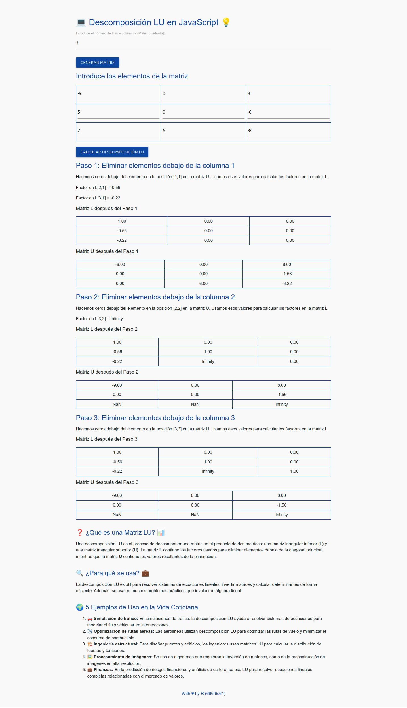

# 💻 Descomposición LU en JavaScript 💡

## Descripción

Este proyecto es una implementación interactiva de la descomposición **LU** (Lower-Upper) en matrices cuadradas, usando **JavaScript**. Permite a los usuarios ingresar una matriz cuadrada de cualquier tamaño (hasta 10x10), descomponerla en matrices **L** y **U**, y seguir un paso a paso del proceso de eliminación gaussiana.

La aplicación está construida con **HTML**, **CSS** y **JavaScript**. Además, utiliza **Materialize CSS** para mejorar el estilo de la interfaz. Es ideal para aquellos interesados en aprender más sobre álgebra lineal y descomposición de matrices de manera visual y sencilla.

---

## Características

- **Interfaz interactiva**: Ingresar valores para cualquier matriz cuadrada y obtener una descomposición LU.
- **Explicación paso a paso**: Se muestra el proceso paso a paso para hacer ceros debajo de la diagonal.
- **Visualización de resultados**: Se muestran las matrices **L** y **U** en cada paso del proceso.
- **Responsiva**: La página es totalmente responsive, permitiendo su uso en dispositivos móviles y pantallas más pequeñas.
- **Material UI**: Utiliza **Materialize CSS** para un diseño limpio y moderno.

---

## Requisitos

- Navegador web moderno (Google Chrome, Firefox, Safari, etc.).
- Conexión a Internet para cargar los estilos desde **Materialize CSS**.

---

## Instalación

### Clonar el repositorio

git clone https://github.com/tu-usuario/tu-repositorio.git

## Estructura del proyecto

|-- index.html
|-- styles.css
|-- script.js
|-- index.jpeg
|-- README.md

## Ejemplo de Uso

1. Selecciona una matriz de tamaño 3x3.
2. Introduce los siguientes valores:

|   | A1 | A2 | A3 |
|---|----|----|----|
| **A1** | 2  | 4  | 1  |
| **A2** | 1  | 5  | 2  |
| **A3** | 3  | 7  | 4  |

3. Haz clic en **"Calcular Descomposición LU"** y observa el proceso paso a paso para obtener las matrices **L** y **U**.

## Contribuciones

¡Las contribuciones son bienvenidas! Si tienes ideas de mejoras o encuentras algún error, por favor siéntete libre de hacer un **fork** del repositorio y enviar un **pull request**. Cualquier sugerencia será apreciada para mejorar el proyecto.

---

## Licencia

Este proyecto está licenciado bajo la Licencia MIT.

